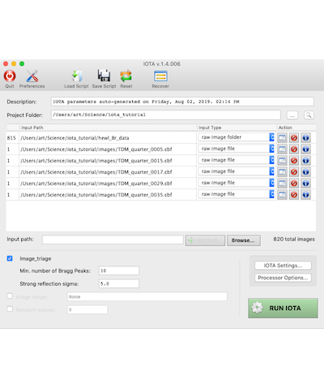
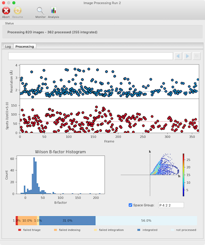

# IOTA: Integration Optimization, Triage and Analysis

IOTA is a user-friendly front end for `dials.stills_process`, a serial
diffraction data processing program. IOTA is comprised of three main modules:

1.  Raw image import, pre-processing and triage
2.  Image indexing, lattice model refinement, and integration using
    `dials.stills_process`
3.  Analysis of the integrated dataset

IOTA can be run as a GUI or from the command-line; scripts can be used for
both, interchangeably. The GUI has the advantage of displaying useful
statistics; it can also be run in "monitor mode" during live data collection,
during which the program will wait for new images to be written into the
specified input folder. The command-line mode is useful if the program is run
remotely on servers that do not, for some reason, support graphics.

## Reference

Please note that IOTA is a front-end for other processing software. Therefore,
the preferred construction for citation should be something like "data were
processed with IOTA [1] using serial diffraction data reduction algorithms
implemented in DIALS [2, 3]".

**[1]** IOTA: integration optimization, triage and analysis tool for the processing
of XFEL diffraction images. Lyubimov AY, Uervirojnangkoorn M, Zeldin OB,
Brewster AS, Murray TD, Sauter NK, Berger JM, Weis WI, Brunger AT. J Appl
Crystallogr. 2016 May 11;49(Pt 3):1057-1064

**[2]** DIALS: implementation and evaluation of a new integration package. Winter,
G., Waterman, D. G., Parkhurst, J. M., Brewster, A. S., Gildea, R. J., Gerstel,
M., Fuentes-Montero, L., Vollmar, M., Michels-Clark, T., Young, I. D., Sauter,
N. K. & Evans, G. (2018). Acta Cryst. D74, 85-97.

**[3]** Improving signal strength in serial crystallography with DIALS geometry
refinement. Brewster, A. S., Waterman, D. G., Parkhurst, J. M., Gildea, R. J.,
Young, I. D., O'Riordan, L. J., Yano, J., Winter, G., Evans, G. & Sauter, N. K.
(2018). Acta Cryst. D74, 877-894.

For an example of how the IOTA/PRIME pipeline was used to solve a structure from a small dataset, see

**[4]** Advances in X-ray free electron laser (XFEL) diffraction data processing applied to the crystal structure of the synaptotagmin-1 / SNARE complex. Lyubimov AY, Uervirojnangkoorn M, Zeldin OB, Zhou Q, Zhao M, Brewster AS, Michels-Clark T, Holton JM, Sauter NK, Weis WI, Brunger AT. Elife. 2016 Oct 12;5.

## Disclaimer Notice

The items furnished herewith were developed under the sponsorship 
of the U.S. Government (U.S.).  Neither the U.S., nor the U.S. 
Department of Energy (D.O.E.), nor the Leland Stanford Junior 
University (Stanford University), nor their employees, makes any
warranty, express or implied, or assumes any liability or 
responsibility for accuracy, completeness or usefulness of any 
information, apparatus, product or process disclosed, or represents
that its use will not infringe privately-owned rights.  Mention of
any product, its manufacturer, or suppliers shall not, nor is it 
intended to, imply approval, disapproval, or fitness for any 
particular use.  The U.S. and Stanford University at all times 
retain the right to use and disseminate the furnished items for any
purpose whatsoever.                                 Notice 91 02 01

Work supported by the U.S. D.O.E under contract DE-AC03-76SF00515; 
and the National Institutes of Health, National Center for Research 
Resources, grant 2P41RR01209. 
